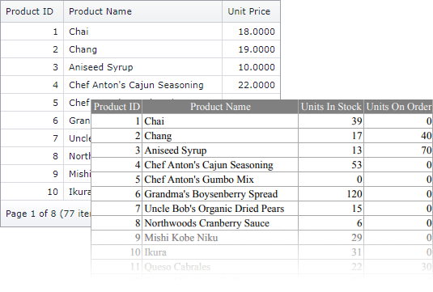

<!-- default badges list -->

[](https://supportcenter.devexpress.com/ticket/details/E4915)
[](https://docs.devexpress.com/GeneralInformation/403183)
<!-- default badges end -->

# GridView for ASP.NET MVC - How to hide and add columns in an exported document
<!-- run online -->
**[[Run Online]](https://codecentral.devexpress.com/e4915/)**
<!-- run online end -->

This example demonstrates how to use different grid settings to display the grid in the view and to export its data.



The main idea of this approach is to pass a parameter to the method that creates [GridViewSettings](https://docs.devexpress.com/AspNetMvc/DevExpress.Web.Mvc.GridViewSettings) to indicate if the settings are created to display the grid or export data.

**Display Grid**
``` razor
@Html.DevExpress().GridView(HomeController.ExportHelper.GetGridViewSettings(false)).Bind(Model).GetHtml()
```

**Export Data**
```csharp
public ActionResult Export() {
    var model = Product.GetProducts();
    return GridViewExtension.ExportToPdf(ExportHelper.GetGridViewSettings(true), model);
}
```

In this example, the [Columns](https://docs.devexpress.com/AspNetMvc/DevExpress.Web.Mvc.GridViewSettings.Columns) collection contains a different set of columns based on the `isExport` parameter value.

```csharp
public static class ExportHelper {
    static public GridViewSettings GetGridViewSettings(bool isExport) {
        GridViewSettings settings = new GridViewSettings();
        // ...
        if (isExport) {
            //Columns only to export
            settings.Columns.Add("UnitsInStock");
            settings.Columns.Add("UnitsOnOrder");
        } else {
            //Columns only to display on the web page
            settings.Columns.Add("UnitPrice");
        }
        return settings;
    }
}
```


## Files to Review

* [HomeController.cs](./CS/E4915/Controllers/HomeController.cs) (VB: [HomeController.vb](./VB/E4915/Controllers/HomeController.vb))
* [DataHelper.cs](./CS/E4915/Models/DataHelper.cs) (VB: [DataHelper.vb](./VB/E4915/Models/DataHelper.vb))
* [_GridViewPartial.cshtml](./CS/E4915/Views/Home/_GridViewPartial.cshtml)

